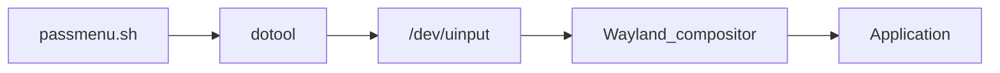

# passmenu - Wayland Password Manager Interface 🔐

**passmenu** is a lightweight Wayland-native password manager interface that integrates with the standard `pass` password store. Designed specifically for compositors like Niri, it provides optimal workflow for password management.

## Features ✨

- **Four distinct access methods**:
  - 🔡 Direct typing (with final Enter press)
  - 📋 Clipboard copying with visual verification
  - 🚀 Auto-paste functionality for GUI apps
  - 📄 Clipboard content integration in all modes
- **Universal clipboard support**: Use clipboard content in any mode
- Wayland-native implementation
- Full compatibility with Niri WM
- Minimal dependencies
- Visual desktop notifications

## Installation ⚙️

### 1. Install essential dependencies
```bash
# Debian/Ubuntu
sudo apt install pass fuzzel wl-clipboard libnotify-bin

# Arch Linux
sudo pacman -S pass fuzzel wl-clipboard libnotify
```

### 2. Install dotool from source
```bash
# Clone dotool repository
git clone https://git.sr.ht/~geb/dotool
cd dotool

# Build and install
sudo make install
```

### 3. Configure permissions
```bash
# Add user to input group
sudo usermod -aG input $USER

# Verify group membership
groups | grep input

# Important: Log out and back in for changes to take effect
```

### 4. Install passmenu
```bash
curl -o ~/.local/bin/passmenu https://raw.githubusercontent.com/yourusername/passmenu/main/passmenu.sh
chmod +x ~/.local/bin/passmenu
```

## Niri Configuration 🔑
Add to the binds section
```toml
    Mod+Ctrl+P hotkey-overlay-title="Paste password" { spawn "sh" "-c" "passmenu --paste"; }
    Mod+Alt+P hotkey-overlay-title="Copy password" { spawn "sh" "-c" "passmenu"; }
    Mod+P hotkey-overlay-title="Type password" { spawn "sh" "-c" "passmenu --type"; }
```

## How It Works ⚙️

### Dotool Implementation
This dotool fork uses direct `/dev/uinput` access without requiring a separate service (unlike ydotool). Key advantages:

- **Lower latency**: Input happens immediately
- **Simpler architecture**: No background daemon needed
- **Resource efficient**: Less system overhead



## Usage 🚀

| Mode         | Trigger        | Ideal For          | Notification             |
|--------------|---------------|--------------------|--------------------------|
| Auto-Paste   | Mod+Ctrl+P    | Browser forms      | Password Pasted 📥      |
| Copy         | Mod+Alt+P     | Universal          | Password Copied 📋      |
| Direct Type  | Mod+P         | Terminal sessions  | Password Entered ⌨     |

### Clipboard Integration 📋
All modes now include a **"Use Clipboard Content"** option in the selection menu that:
- **Direct Type mode**: Types clipboard content + Enter
- **Auto-Paste mode**: Copies to clipboard + types content
- **Copy mode**: Prints clipboard content to terminal

## Troubleshooting 🔧

### "Input permission denied"
```bash
# Verify uinput permissions
ls -l /dev/uinput | grep 'input'

# If missing group access:
sudo chown root:input /dev/uinput
sudo chmod 660 /dev/uinput
```

### Dotool testing
```bash
# Test keyboard input
echo "type hello_system" | dotool

# Test enter key
echo "key enter" | dotool
```

## Uninstall 🗑️
```bash
# Remove passmenu script
rm ~/.local/bin/passmenu

# Remove dotool
sudo rm /usr/local/bin/dotool
```

## License 📜
MIT License - See [LICENSE](https://opensource.org/licenses/MIT)

---

**Enjoy secure password management on Wayland!** 🎉  
For support and contributions, visit [GitHub repository](https://github.com/evgenyzh/passmenu)

